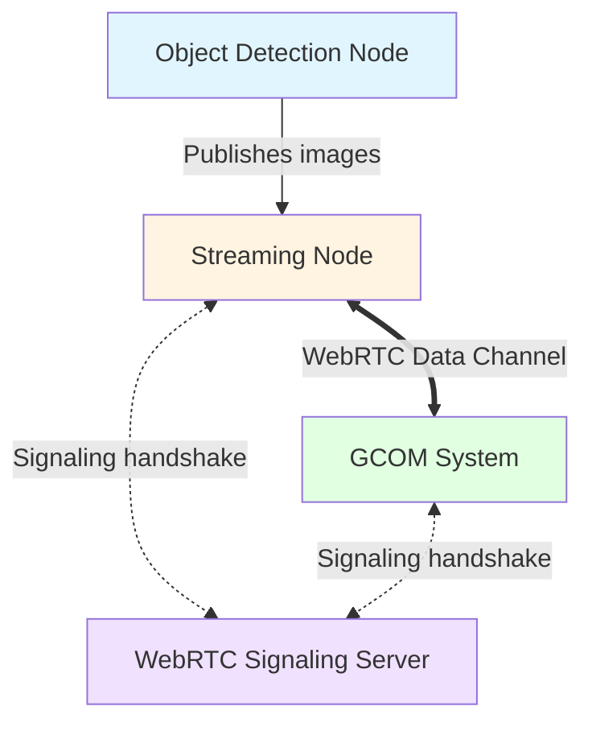

# Streaming Architecture

## Overview

The streaming system enables real-time transmission of object detection images from the ROS environment to the Ground Communications (GCOM) system via WebRTC.

## Architecture Diagram



## Components

### Object Detection Node
Processes camera input and publishes detected objects with associated image data to a ROS topic.

### Streaming Node
The central component for media transmission:
- Subscribes to object detection image topic
- Establishes and maintains WebRTC connection to GCOM
- Transmits images over the WebRTC data channel
- Handles all WebRTC peer connection logic

### WebRTC Signaling Server
Standalone server that facilitates WebRTC connection establishment:
- Located in `infrastructure/webrtc_signaling_server`
- Coordinates the exchange of session descriptions (SDP) and ICE candidates
- Does not handle media/data transmission itself

### GCOM System
Ground communications system (separate repository) that receives and processes the image stream.

## WebRTC Connection Flow

1. **Initialization**: Streaming node and GCOM each connect to the signaling server via WebSocket
2. **Offer/Answer**: Peers exchange SDP offers and answers through the signaling server
3. **ICE Negotiation**: Peers exchange ICE candidates to establish optimal network path
4. **Connection Established**: Direct peer-to-peer WebRTC data channel is established
5. **Data Transmission**: Images flow directly from streaming node to GCOM over the data channel
6. **Signaling Complete**: Signaling server is no longer needed after connection establishment

## Data Flow

```
Camera → Object Detection → ROS Topic → Streaming Node → WebRTC → GCOM
```

The streaming node acts as the bridge between the ROS ecosystem and the external GCOM system, encapsulating all WebRTC complexity in a single, focused component.
